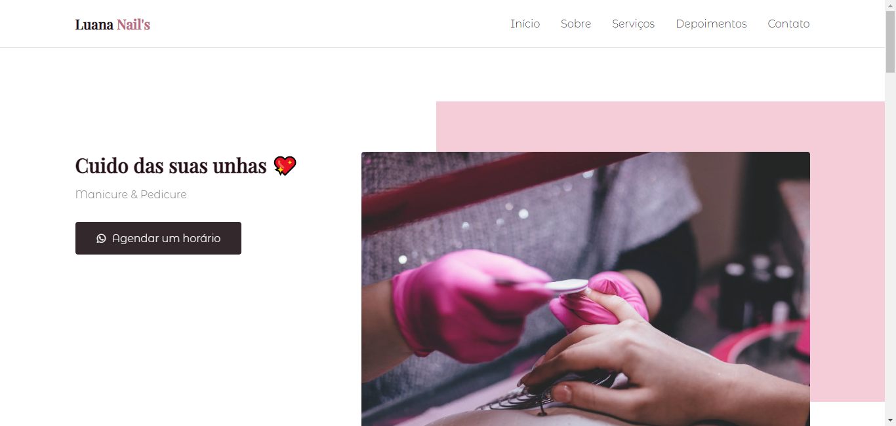
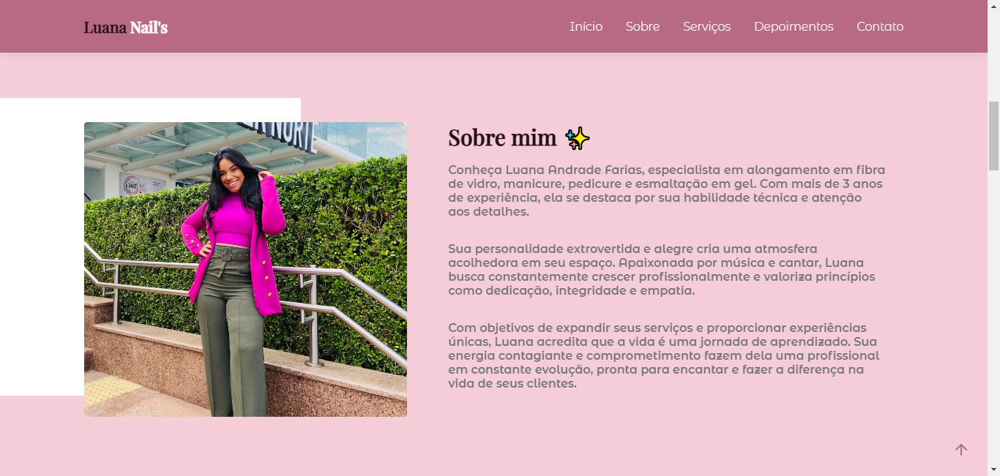

# Luana Nail's - Website Readme

## Sobre o Site

Luana Nail's é um site comercial que apresenta o trabalho da talentosa manicure Luana. O site foi desenvolvido por Anderson Farias utilizando as tecnologias React e Next.js, garantindo uma experiência de usuário suave e responsiva. Nele, você poderá encontrar uma variedade de fotos que exibem o incrível trabalho de Luana em design de unhas.

## Acesso ao Site

O site Luana Nail's está hospedado na plataforma Vercel e pode ser acessado através do seguinte link: [https://luananaildesigner.vercel.app/](https://luananaildesigner.vercel.app/)

## Demonstração





## Tecnologias Utilizadas

-   Next.js 13.4.10
-   next-reveal 1.0.6
-   React 18.2.0
-   React-DOM 18.2.0
-   React Photo Gallery 8.0.0
-   Swiper 10.0.4

## Estrutura do Projeto

O código-fonte do site está organizado da seguinte maneira:

```
📁 /src
  📁 /assets              # Arquivos de mídia e recursos gráficos
  📁 /components          # Componentes reutilizáveis
    📁 /buttons
    📁 /sections
  📁 /pages               # Páginas do site
  📁 /styles              # Arquivos de estilos
```

## Executando o Projeto Localmente

Para executar o projeto em ambiente de desenvolvimento, siga os passos abaixo:

1. Clone o repositório do projeto:

```
git clone https://github.com/seu-usuario/luana-nails.git
```

2. Navegue para o diretório do projeto:

```
cd luana-nails
```

3. Instale as dependências utilizando o gerenciador de pacotes yarn:

```
yarn install
```

4. Inicie o servidor de desenvolvimento:

```
yarn dev
```

5. O site estará disponível em `http://localhost:3000`.

---

Feito com 🤍 by Anderson Farias.
